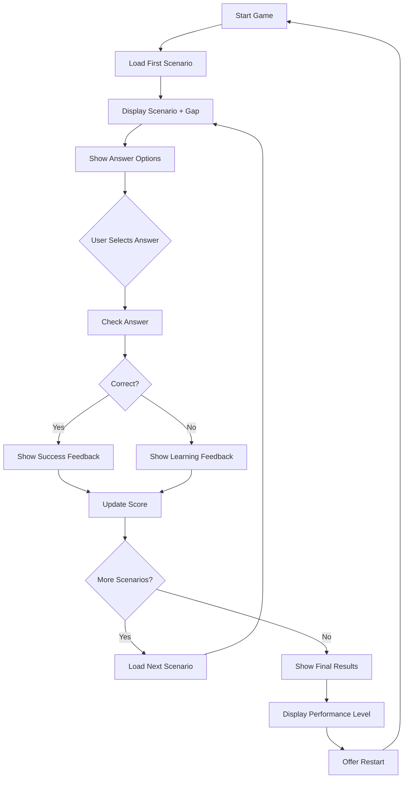
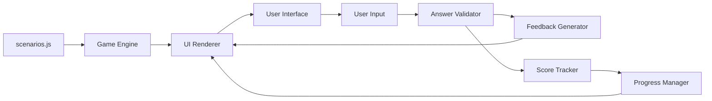

# Why It Matters Builder - Game Design & Implementation Plan

## Project Overview
A web-based training game to help sales reps strengthen their ability to articulate business risk and impact when discussing Agentic Runtime Security gaps.

## Tech Stack
- **HTML5** - Structure and content
- **CSS3** - Styling and responsive design
- **Vanilla JavaScript** - Game logic and interactivity
- **GitHub Pages** - Hosting (zero-cost, instant deployment)

## Game Mechanics

### Core Flow
```
Start → Scenario Presentation → Answer Selection → Immediate Feedback → Score → Next Scenario
```

### Two Game Modes

#### 1. Multiple Choice Mode (MVP)
- Present scenario with identified gap
- Show 3-4 answer options (A, B, C, D)
- Player selects best "why it matters" statement
- Immediate feedback with explanation
- Score based on correctness

#### 2. Advanced Mode (Future Enhancement)
- Player writes their own response
- Scored on three criteria:
  - Risk Clarity (1-5)
  - Impact (1-5)
  - Consequence (1-5)
- Provides improvement suggestions

## User Interface Design

### Layout Structure
```
┌─────────────────────────────────────┐
│         Game Header/Title           │
├─────────────────────────────────────┤
│  Progress: [■■■□□] 3/5  Score: 2/3  │
├─────────────────────────────────────┤
│                                     │
│         Scenario Card               │
│  ┌───────────────────────────────┐ │
│  │ Gap: Accountability           │ │
│  │                               │ │
│  │ Scenario: "All our agents     │ │
│  │ share the same database       │ │
│  │ credential."                  │ │
│  └───────────────────────────────┘ │
│                                     │
│  Question: Why does this matter?    │
│                                     │
│  ○ A) That's not ideal             │
│  ○ B) It could cause confusion     │
│  ○ C) If there's a breach, you     │
│       won't be able to trace it... │
│                                     │
│         [Submit Answer]             │
│                                     │
└─────────────────────────────────────┘
```

### Feedback Display
```
┌─────────────────────────────────────┐
│  ✓ Correct! / ✗ Incorrect          │
├─────────────────────────────────────┤
│  Explanation:                       │
│  This answer clearly connects the   │
│  gap to a specific business risk... │
│                                     │
│  Key Elements:                      │
│  ✓ Identifies specific consequence  │
│  ✓ Uses business language          │
│  ✓ Creates urgency                 │
│                                     │
│         [Next Scenario]             │
└─────────────────────────────────────┘
```

## Scenario Data Structure

```javascript
const scenarios = [
  {
    id: 1,
    gap: "Accountability",
    scenario: "All our agents share the same database credential.",
    question: "Why does this matter to the customer?",
    options: [
      {
        text: "That's not ideal for security.",
        score: 0,
        feedback: "Too vague. Doesn't explain the business impact."
      },
      {
        text: "It could cause confusion in your logs.",
        score: 1,
        feedback: "Better, but still doesn't convey urgency or real risk."
      },
      {
        text: "If there's a breach, you won't be able to trace which agent was compromised—making forensics impossible and extending your recovery time.",
        score: 3,
        feedback: "Excellent! This clearly connects the gap to specific business consequences."
      }
    ],
    correctIndex: 2,
    imperative: "Register Agents",
    learningPoints: [
      "Identifies specific consequence (impossible forensics)",
      "Uses business language (recovery time)",
      "Creates urgency (breach scenario)"
    ]
  }
  // ... more scenarios
];
```

## Scenario Content Plan

### Based on ARS Workshop - 4 Critical Gaps

#### Accountability Scenarios (3-4 scenarios)
- Shared service accounts
- No unique agent identifiers
- Missing audit trails
- Untraceable actions

#### Over-Privilege Scenarios (3-4 scenarios)
- Broad standing permissions
- Excessive data access
- No least privilege implementation
- Expanded blast radius

#### Delegation/Impersonation Scenarios (3-4 scenarios)
- Agents inheriting user identity
- No distinction between human/agent actions
- Broken accountability chain
- Identity confusion

#### Last Mile Access Scenarios (3-4 scenarios)
- Shared credentials
- No real-time enforcement
- Missing execution-time validation
- High-risk access at machine speed

**Total: 12-16 scenarios for MVP**

## Scoring System

### Multiple Choice Mode
- **3 points** - Best answer (clear risk + impact + consequence)
- **1 point** - Acceptable answer (identifies risk but weak impact)
- **0 points** - Poor answer (vague or no business impact)

### Performance Levels
- **Mastery**: 90%+ (11-12 correct out of 12)
- **Proficient**: 75-89% (9-10 correct)
- **Developing**: 60-74% (7-8 correct)
- **Needs Practice**: <60% (6 or fewer correct)

## File Structure

```
why-it-matters-builder/
├── index.html           # Main game page
├── styles.css           # All styling
├── game.js             # Game logic and state management
├── scenarios.js        # Scenario data
├── README.md           # Setup and deployment instructions
└── assets/             # (Optional) Images, icons
    └── logo.png
```

## Key Features for MVP

### Must Have
- ✅ Scenario presentation with gap identification
- ✅ Multiple choice answer selection
- ✅ Immediate feedback with explanations
- ✅ Score tracking
- ✅ Progress indicator
- ✅ Responsive design (mobile-friendly)
- ✅ Clean, professional UI

### Nice to Have (Future)
- 🔄 Free-text response mode
- 🔄 Scenario randomization
- 🔄 Performance analytics
- 🔄 Leaderboard
- 🔄 Certificate generation
- 🔄 Save/resume progress

## Implementation Phases

### Phase 1: Core Game (MVP)
1. HTML structure with semantic markup
2. CSS styling with professional design
3. JavaScript game engine
4. 12 scenarios covering all 4 gaps
5. Multiple choice interface
6. Feedback system
7. Basic scoring

### Phase 2: Enhancement
1. Additional scenarios (expand to 20+)
2. Scenario randomization
3. Performance summary page
4. Improved feedback with learning tips
5. Mobile optimization

### Phase 3: Advanced Features
1. Free-text response mode
2. AI-powered response evaluation
3. Progress persistence (localStorage)
4. Analytics dashboard
5. Shareable results

## Design Principles

### User Experience
- **Immediate feedback** - No waiting, instant learning
- **Clear progression** - Always know where you are
- **Encouraging tone** - Focus on learning, not punishment
- **Professional appearance** - Reflects enterprise training quality

### Content Quality
- **Real scenarios** - Based on actual customer situations
- **Business language** - Not technical jargon
- **Actionable feedback** - Explains why answers work or don't
- **Consistent structure** - Gap → Risk → Impact → Consequence

## Deployment Strategy

### GitHub Pages Setup
1. Create repository: `why-it-matters-builder`
2. Push code to main branch
3. Enable GitHub Pages in settings
4. Access at: `https://[username].github.io/why-it-matters-builder/`

### Testing Checklist
- [ ] All scenarios load correctly
- [ ] Answer selection works
- [ ] Feedback displays properly
- [ ] Score calculates accurately
- [ ] Progress tracking functions
- [ ] Mobile responsive
- [ ] Cross-browser compatible (Chrome, Firefox, Safari, Edge)

## Success Metrics

### For Learners
- Complete all scenarios
- Achieve 75%+ score
- Understand why answers work
- Apply learning to real conversations

### For Program
- Easy to access (single URL)
- Quick to complete (15-20 minutes)
- Engaging and interactive
- Reinforces workshop concepts

## Next Steps

1. **Review this plan** - Confirm approach and features
2. **Build MVP** - Focus on core functionality first
3. **Test with users** - Get feedback from 2-3 sales reps
4. **Iterate** - Improve based on feedback
5. **Scale** - Add more scenarios and features

---

## Mermaid Diagram: Game Flow



## Mermaid Diagram: Data Flow



---

**Ready to build!** This plan provides a clear roadmap for creating an effective, engaging training game that reinforces the core ARS Workshop concepts.